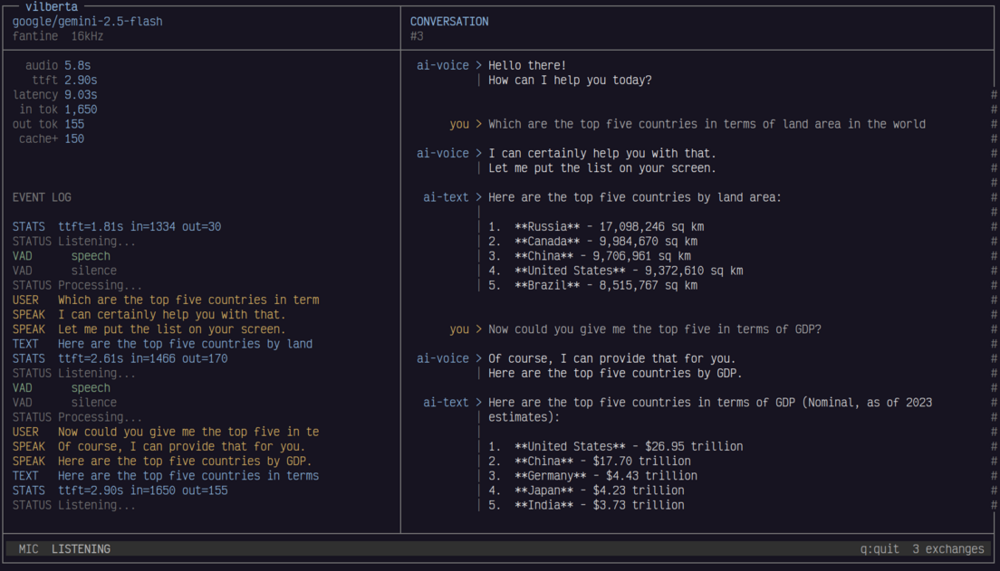

# Vilberta

An interactive voice assistant powered by LLMs, featuring a three-stage ASR + LLM + TTS pipeline, intelligent interruption handling, and MCP support for tool calling.

Core Objective: **Not everything needs to be spoken**. 

Vilberta intelligently separates conversational responses (audio) from visual content like code, lists, and data (text), creating a more natural and efficient interaction model.



## Features

- **Voice Interaction**: Bidirectional audio communication with hands-free operation
- **Voice Activity Detection (VAD)**: Uses Silero VAD for automatic speech detection
- **Context-Aware Transcription**: Uses conversation history to improve accuracy for technical terms
- **Smart Interruption Handling**: Gracefully interrupts TTS when you speak and resumes context
- **MCP Integration**: Support for Model Context Protocol with tool calling capabilities
- **Multimodal Output**:
  - `[speak]`: Audio responses for conversational interaction
  - `[text]`: Visual content for code, lists, and complex information
- **Audio Feedback**: Sound effects for user events and system states
- **Rich Terminal Interface**: Basic CLI and TUI (Text User Interface) options

> [!NOTE]
> **There is no echo cancellation**, so use a headset or use some conference call speaker with built-in echo cancellation capabilities -- to avoid speaker audio going back into mic.

## Architecture

Vilberta uses a three-stage pipeline approach instead of direct speech-to-speech models. This design choice was made because multimodal models currently have poor tool calling capabilities, which are essential for practical applications.

**Pipeline stages:**
1. **ASR (Automatic Speech Recognition)**: Gemini 2.5 Flash (transcription only)
2. **LLM (Large Language Model)**: 
   - GPT-4o mini for basic chat
   - Gemini 2.5 Flash for tool calling with MCP
3. **TTS (Text-to-Speech)**: Pockety TTS (runs locally)

## Installation

1. Clone the repository:
```bash
git clone https://github.com/charstorm/vilberta.git
cd vilberta
```

2. Create and activate a virtual environment:
```bash
python -m venv venv
source venv/bin/activate
```

3. Install dependencies:
```bash
pip install -r requirements.txt
```

4. Set your OpenRouter API key:
```bash
export OPENROUTER_API_KEY="your-openrouter-api-key"
```

## Configuration

Vilberta can be configured via `config.toml`. Key settings include:

- **Mode**: `basic` (simple chat) or `mcp` (with tool calling support)
- **Models**: Configure ASR, chat, and tool calling models separately
- **TTS Voice**: Choose from available voices (alba, marius, javert, jean, fantine, cosette, eponine, azelma)
- **Context Management**: Adjust history size and pruning thresholds

See `config.toml` for detailed configuration options.

## Usage

Start the voice assistant with TUI interface:

```bash
python -m vilberta -i tui
```

Start with basic CLI interface:

```bash
python -m vilberta -i cli
```

### Operating Modes

- **Basic Chat Mode**: Simple conversational interaction with the LLM
- **MCP Mode**: Full tool calling capabilities with MCP server integration

Configure the mode in `config.toml` before starting the application.

## Known Issues

- **Sound Effect Timing**: Sound effects may occasionally overlap with TTS output, creating jarring transitions. The current implementation has more sound effects than necessary.
- **NNPACK Warnings**: You may see `Could not initialize NNPACK! Reason: Unsupported hardware` warnings on startup. These are typically harmless and restarting the application usually resolves them.
- **TTS Hang**: The application may hang if exited (q for quit) during TTS playback of an utterance. Wait for the end of TTS to quit.

## Technical Notes

- Currently supports OpenRouter API, but can be extended to work with any OpenAI-compatible API provider
- The three-stage architecture ensures robust tool calling while maintaining conversational quality

## Contributing

Vibe-coded PRs are encouraged! But please keep them usable and stable.

Make sure to fix issues with `ruff check vilberta` and `mypy --strict vilberta` before submitting.
